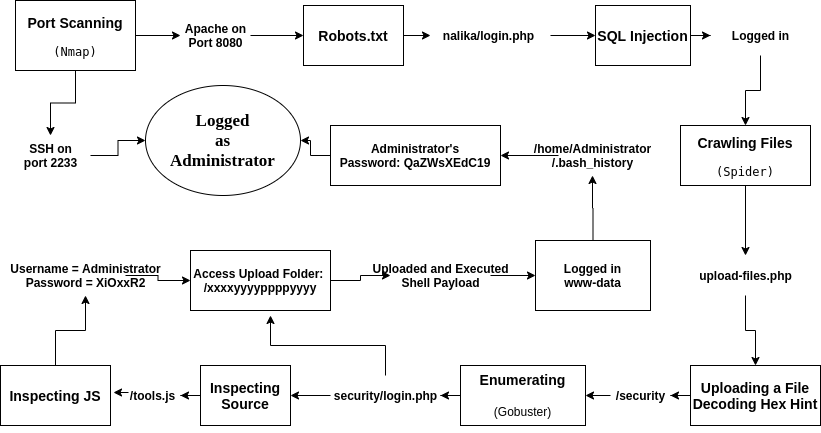
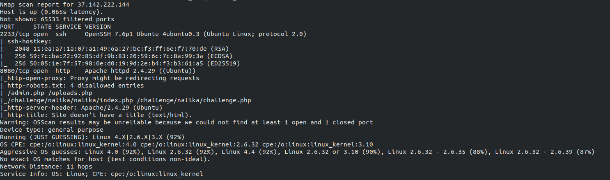
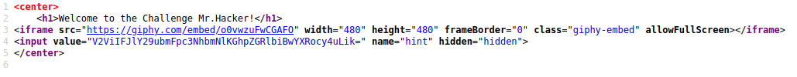
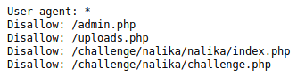
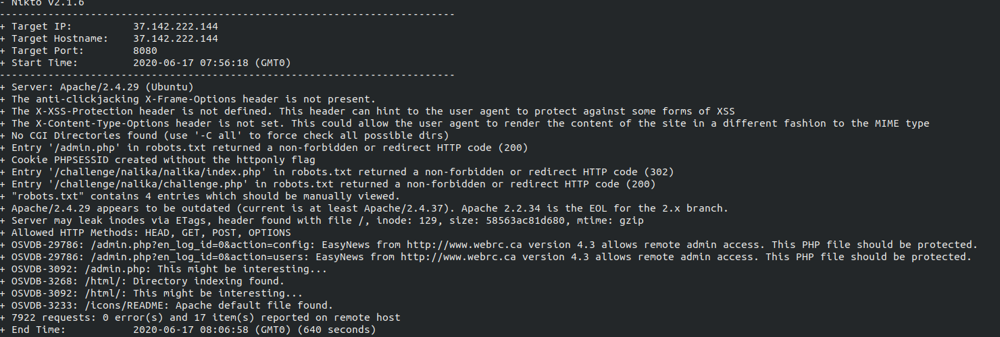
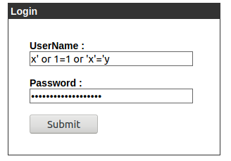
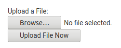
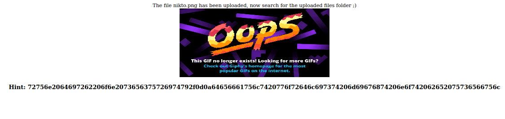
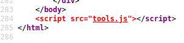

# Final Report - 37.142.222.144

## Summary

1. As part of a final exam in a Penetration-testing course in *see-security*, I was tasked with examining the exposure of a web-connected machine to an outside attacker.
2. The exam was done in a *Capture The Flag* format, meaning that the goal was to infiltrate the machine and get privileged execution permissions.
3. I was not given any preliminary details other than the machine's IP address, in order to simulate an uninformed outside attacker.
4. The exam was restricted to about 8-hour window, and was completed in less than 5 hours (including lunch), but who's counting.
5. The main result: I was able to achieve the goal of privileged permissions, and unearthed several severe vulnerabilities in the machine.
6. Detailed report and suggested remedies are as follows, but it should be noted that the *CTF* format truncate the examination as soon as the target is achieved, thus this is in no way a full penetration test for the machine, and many other vulnerabilities may be present. 

## Attack Flow

* We'll describe here in details the road to privileged presence on the machine.
* Other information gained and techniques used are mentioned here, in the name of full discovery and reproducibility.
* Naturally, this report focuses on the aspects of your system's security which were relevant for the attack. some irrelevant details may be omitted.

### Flowchart Summary


----

### 1. Port Scanning


1. The machine doesn't responds to `ping` requests. 
2. Apache web server is running on port 8080 (instead of the usual 80)
2. OpenSSH is running on port 2233 (instead of the usual 22)

#### Tools used:
+ **Nmap** - full scan, with version and OS detection, `Pn` flag to disable *ping*.

---

### 2. File Enumeration & Inspection

1. *37.142.222.144:8080/index.html* isn't shy about giving us a clue inside a hidden input field:

    
2. After decoding from Base64, we get:
    > Web Reconnaissance(hidden paths...)
3. (discovered only after we got root but it's relevant and important here): the path */html.tar.gz* contain a backup of the website! our wordlists weren't quite capable enough to catch it, but others will. this backup will allow any visitor who download it to skip the next steps and infiltrate your system in a couple of clicks.
4. */robots.txt* contain some interesting entries:
    
    
    * */challenge/nalika/challenge.php* is a decoy
    * */upload.php* is restricted
    * */challenge/nalika/nalika/index.php* redirects to */challenge/nalika/nalika/login.php*

#### Tools used
+ **gobuster** - many wordlists, with all kinds of extensions and recursive inspection.
+ **Nikto** - came up with some warnings you should check out.

    
+ **ZAP 10** - didn't discover anything.

---

### 3. SQL Injection
1. Using some fuzzing, we found the login form in *login.php* was vulnerable to SQL injection. among the many accepted queries:

    

#### Tools used
+ **wfuzz** - fuzz POST request for the login-form with sql-injection query list.

---

### 4. Remote File Inclusion 
1. Crawling the files we discovered */challenge/nalika/nalika/upload-files.php* where we can upload a file:

    
2. After uploading a file, we get the following message:
    
    
3. Decoding from *hex* reveal the following message:
    > run dirb on security/  
    > default wordlist might not be useful
4. Following the kind helper, we discovered */challenge/nalika/nalika/security/login.php*
5. Looking at the page's source-code, we found it uses a local script:

    

(It's colored in red to make sure any interested hacker will catch it...)

6. This is the code from */challenge/nalika/nalika/security/tools.js*:
```javascript
$("#loginForm").on("submit", function(e) {
    e.preventDefault();
    var o = $("#login").val(),
        r = $("#password").val();
    if ("Administrator" === o)
        if (7 === r.length) {
            if (72 == (16 ^ r.charCodeAt(0)) && r.charCodeAt(1) << 2 == 420 && r.charCodeAt(2) + 44 === 123 && r.charCodeAt(3) >> 3 == 15 && 120 === r.charCodeAt(4) && r.charCodeAt(5) - 290 == -208 && r.charCodeAt(6) + r.charCodeAt(4) === 170) {
                var a = r + "5W!p91";
                $.post("login.php", {
                    login: o,
                    password: a
                }, function(e) {
                    alert("Success! redirecting to the next stage..."), window.location.replace(e)
                })
            }
        } else alert("Wrong Password");
    else alert("Wrong Username")
});
```
7. Right away, we see the username is **Administrator**. the password took some work with bit-wise operations and school-level math, until we got: **XiOxxR2**
8. Using the found credentials in the login-page redirected us to the upload folder: */challenge/nalika/nalika/xxxxyyyyppppyyyy*
9. Now we can upload and execute PHP files. we generated a reverse-php-shell payload, uploaded it, executed, and we got a shell, which we obviously upgraded to *Meterpreter* right away.

#### Tools used
+ **Metasploit** - auxiliary module for crawling web pages with session cookies (to be able to view the pages with authenticated session). created reverse PHP shell payload and started a session
+ **gobuster** - again

---

### 5. Privilege Escalation
1. Using `cat \etc\passwd` and other checks we discovered that the machine has the users *root*, *Administrator* with `sudo` privileges, and *webadmin*.
2. First inspection was done using [this script](https://github.com/carlospolop/privilege-escalation-awesome-scripts-suite/blob/master/linPEAS/linpeas.sh) which flagged all kinds of possible avenues to move forward.
3. The most interesting discovery was that the file */home/Administrator/.bash_history* is readable.
4. Reading the Administrator command's history, we follow how he installed and configured the machine. somewhere in the middle of setting up *SSH*, there was a command **QaZWsXEdC19**.
5. On the off chance that this is a password wrongfully pasted, we tried connecting to ssh using the credentials **Administrator** and **QaZWsXEdC19**. and guess what? **We're in!**

---

### * Other stuff
1. Using **hydra** to brute-force SSH (on port 2233) with the most common usernames and passwords - no match.
2. Obviously tried SSH with every credentials found along the way.
3. When logging in to dashboard, the username is *root*. it could be a signal for area worth exploring...

    
4. The Administrator set up and configured all kinds of stuff on MySQL. some PHP files contained the following credentials. could MySQL possess more vulnerabilities?
    > server - localhost  
    > database - exam  
    > username - root  
    > password - SQLpass2019
5. With some reconnaissance, we see that the default *nalika* template doesn't contain any php files, meaning that all those php files we found (and ignored) during enumeration are custom-maid for this machine and inspecting them (in the *html* backup) could reveal more vulnerabilities.

---

## Suggested Fixes

1. Remove all the hints which are designed to help curious hackers.
2. Remove all unnecessary files, especially the *html.tar.gz* folder.
3. Change *robots.txt* to contain more general folders.
4. Sanitize all queries in the first login form, to prevent SQL-injection.
5. Limit permissions to view *tools.js*
6. Change the login script in the second login form so it doesn't contain hardcoded (or lightly obfuscated) credentials.
7. Limit the types of files that can be uploaded (no *PHP* for example)
8. Don't execute uploaded files locally when they're accessed, only on the client side. If you do want to allow it for some reason, do it from a user with limited permissions (especially not networking and reading permissions).
9. Fix reading permissions on */home/Administrator/.bash_history*.
10. **Most importantly**: Pay for a proper penetration test. clearly, your sysadmin was an idiot and there're probably many more misconfigurations and vulnerabilities in your system .